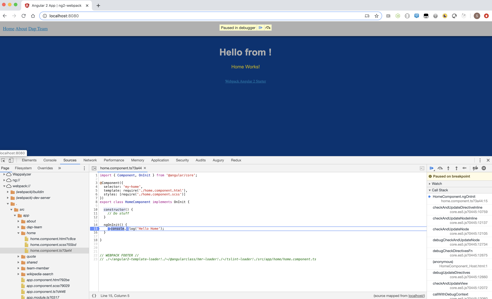
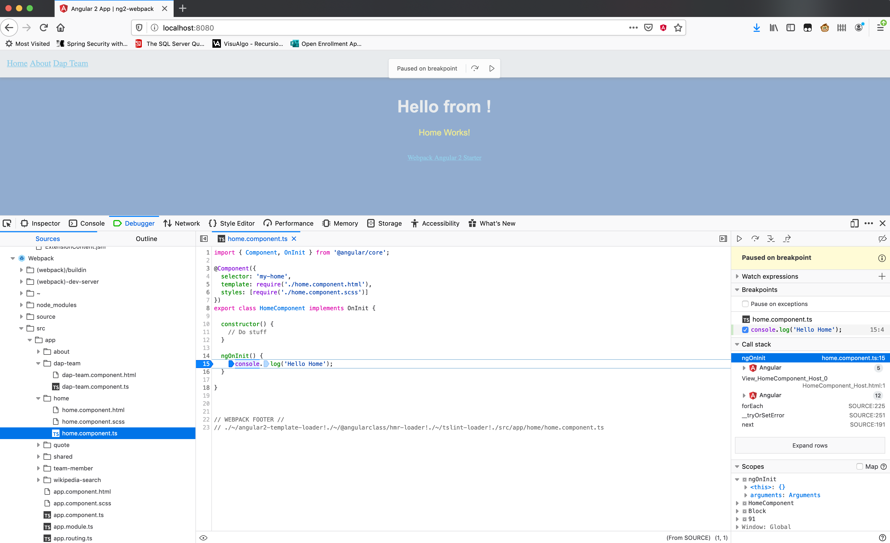
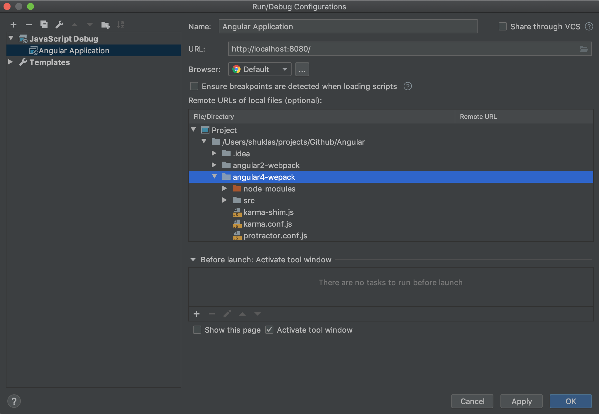

## Debugging Angular Applications

### Chrome DevTools

Using Chrome, open the Developer Tools. In the Sources tab, look for the `webpack://` source. Your application should be under the folder `./`. Set your breakpoints like normal within your application.

> Debugging with Chrome Dev Tools
> 
>
> Debugging with Firefox Dev Tools
> 

### IntelliJ Debugger

In IntelliJ, go to your `Run/Debug Configurations`. Add a new `JavaScript Debug` configuration, with the url set to your application's URL.

Now you can set your breakpoints in IntelliJ like normal. Then launch the Debug configuration you just created. It should open your browser and navigate to the URL you set. When a breakpoint is reached, chrome will pause and IntelliJ should gain focus.

### Debugging Angular apps created with Angular CLI in intellij
* App is started by Angular CLI Server
* Launch Debug Angular Application
* Debug your application

